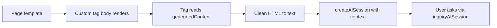

<!--
{
  "title": "AI Context from Page Content",
  "id": "ai-page-context",
  "since": "7.0",
  "categories": ["ai"],
  "description": "Capture rendered page HTML with a custom tag and use it as context for an AI session",
  "keywords": [
    "AI",
    "LLM",
    "custom tag",
    "context",
    "system message",
    "generatedContent",
    "SerializeAISession",
    "LoadAISession"
  ],
  "related": [
    "ai",
    "ai-session-serialization",
    "custom-tag-mappings"
  ]
}
-->

# AI Context from Page Content

Many applications need an assistant that understands **the page the user is looking at** — its labels, options, and visible text — not just a generic chatbot.

The idea is simple:

1. Wrap page content in a custom tag
2. Read the rendered HTML from the tag body
3. Turn that into plain text
4. Pass it to `createAISession()` as the system message (or as part of it)

For AI configuration and core functions, see [[ai]].

## Overview



At **end** execution, a custom tag with a body can read `thistag.generatedContent` — everything that was output between the opening and closing tag. That string is your page context.

## Step 1: Wrap the Page

In your layout or template, wrap the main content:

```cfml
<cf_pageai pageTitle="Product settings">
	<cfoutput>
		<h1>Product settings</h1>
		<p>Configure shipping and tax options for this store.</p>
		<form>
			<label>Tax rate (%)
				<input type="text" name="taxRate" value="8.5">
			</label>
		</form>
	</cfoutput>
</cf_pageai>
```

Place the tag file where Lucee resolves custom tags (for example a mapped custom tag folder). Lucee calls it as `<cf_pageai>` when the file is `pageai.cfm`.

## Step 2: Read the Body in the Tag

`pageai.cfm`:

```cfml
<cfif thisTag.executionMode EQ "end" OR !thisTag.hasEndTag>
<cfscript>
	param name="attributes.pageTitle" default="";

	rawContent = thisTag.hasEndTag ? trim(thistag.generatedContent) : "";
	pageContext = cleanPageContext(rawContent);
	systemMessage = buildSystemMessage(attributes.pageTitle, pageContext);

	aiSession = createAISession(
		name: "mychatgpt",
		systemMessage: systemMessage,
		limit: 8,
		temperature: 0.3
	);
</cfscript>

<cfoutput>
<div class="page-ai" data-ready="true">
	<p class="comment">Ask a question about this page.</p>
	<!--- your question form / widget here --->
</div>
</cfoutput>
</cfif>
```

The tag runs after the body is rendered, so `generatedContent` already contains the final HTML.

## Step 3: Clean the HTML

Strip scripts, styles, and tags so the model gets readable text:

```cfml
function stripTagBlocks(required string raw, required string tagName) {
	var t = arguments.raw;
	var openNeedle = "<" & lCase(arguments.tagName);
	var closeTag = "</" & lCase(arguments.tagName) & ">";
	var openPos = findNoCase(openNeedle, t);

	while (openPos) {
		var closePos = findNoCase(closeTag, t, openPos);
		if (!closePos) break;
		t = left(t, openPos - 1) & " " & mid(t, closePos + len(closeTag));
		openPos = findNoCase(openNeedle, t, openPos);
	}

	return t;
}

function cleanPageContext(required string raw) {
	var t = trim(arguments.raw);
	if (!len(t)) return "";

	t = stripTagBlocks(t, "script");
	t = stripTagBlocks(t, "style");
	t = reReplace(t, "<[^>]+>", " ", "all");
	t = reReplace(t, "[ \t]+", " ", "all");
	t = reReplace(t, "(\r?\n\s*){2,}", chr(10), "all");

	return trim(t);
}
```

Use string functions (`find`, `findNoCase`) on large pages instead of very complex regular expressions.

## Step 4: Build the System Message

Prepend instructions, then append the cleaned page text:

```cfml
function buildSystemMessage(required string pageTitle, required string pageContext) {
	var msg = "You are a helpful assistant for the page described below. "
		& "Answer clearly and keep answers short. "
		& "Only discuss content that appears on this page. "
		& "Do not invent fields or options.";

	if (len(trim(arguments.pageTitle))) {
		msg &= chr(10) & "Page title: #trim(arguments.pageTitle)#";
	}
	if (len(trim(arguments.pageContext))) {
		msg &= chr(10) & chr(10) & "Page content:" & chr(10) & trim(arguments.pageContext);
	}

	return msg;
}
```

You can add optional metadata (page id, product name, user role) the same way — as extra lines before `Page content:`.

## Step 5: Ask Questions

Send user input with `inquiryAISession()`. The session keeps conversation history, so follow-up questions stay in context:

```cfml
answer = inquiryAISession(aiSession, "What does the tax rate field do?");
writeOutput(answer);

// follow-up — the model still knows the page content from the system message
answer = inquiryAISession(aiSession, "What is a typical value?");
writeOutput(answer);
```

For streaming output:

```cfml
inquiryAISession(aiSession, form.question, function(chunk) {
	writeOutput(chunk);
	cfflush(throwOnError=false);
});
```

## Optional: Split Output Around the Widget

If the AI panel should sit **inside** the page flow (not only at the end of the tag), split the captured HTML and output in three parts:

1. Content before the widget → set `thisTag.generatedContent` (tag merge output)
2. The widget itself
3. Content after the widget

Use a marker in the page body, for example `{AI-location}`, or split after a known intro block:

```cfml
marker = "{AI-location}";
markerPos = find(marker, rawContent);

if (markerPos) {
	contentBefore = left(rawContent, markerPos - 1);
	contentAfter = mid(rawContent, markerPos + len(marker));
} else {
	contentBefore = "";
	contentAfter = rawContent;
}

if (thisTag.hasEndTag) {
	thisTag.generatedContent = contentBefore;
}
```

```cfml
<cfoutput>
<!--- widget --->
#contentAfter#
</cfoutput>
```

## Optional: Persist the Session Across Requests

Creating a new session on every page load works for demos. For a chat that survives reloads, serialize the session and store it keyed by page (and user if needed):

```cfml
serialized = serializeAISession(aiSession);
// save serialized in application scope, a cache, or a database

// on the next request:
aiSession = loadAISession("mychatgpt", serialized);
```

See [[ai-session-serialization]] for `maxlength`, `condense`, and cross-model loading.

A common layout is:

- **Custom tag** — capture content, build system message, render widget
- **Separate request handler** — load stored session, call `inquiryAISession()`, save serialized session again

Keep serialized data out of the CFML session if it grows large — application scope or an external store is usually safer.

## Configuration

Use any configured AI connection by name:

```json
"ai": {
  "mychatgpt": {
    "class": "lucee.runtime.ai.openai.OpenAIEngine",
    "custom": {
      "secretKey": "${OPENAI_API_KEY}",
      "model": "gpt-4o-mini",
      "type": "openai",
      "timeout": 30000
    }
  }
}
```

```cfml
if (AIHas("mychatgpt")) {
	// render the widget
}
```

## Security

- Do not send password or secret field values to the model
- If the ask handler is a separate endpoint, protect it like the rest of your app
- Review `ai.log` to see what page content is sent to external providers

## When to Use This

**Good fit:**

- Help on a specific screen (settings, wizards, dashboards)
- “What does this page do?” without maintaining duplicate documentation

**Consider alternatives:**

- Broad knowledge across many topics → [[ai-augmentation-lucene]]
- One-off questions with no page context → direct `inquiryAISession()` without a custom tag

## Related Documentation

- [[ai]] — AI configuration and core functions
- [[ai-session-serialization]] — save and restore conversation state
- [[custom-tag-mappings]] — where to place custom tags and how mappings work
