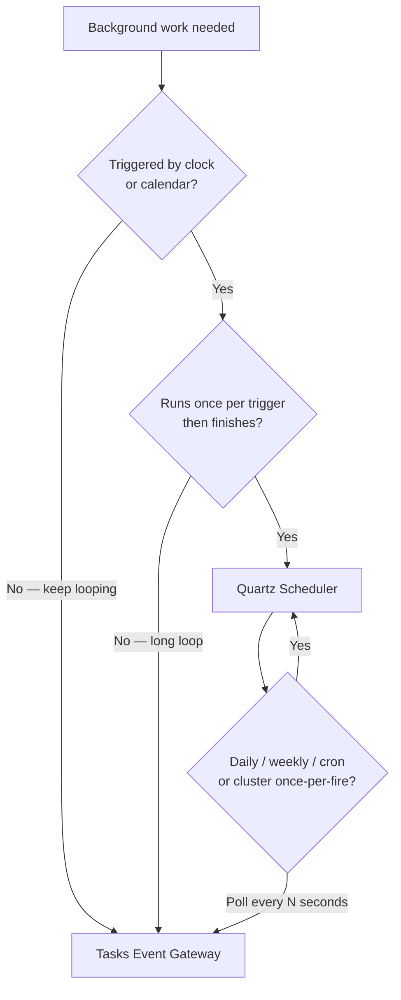

<!--
{
  "title": "Quartz Scheduler vs Tasks Event Gateway",
  "id": "quartz-vs-task-event-gateway",
  "categories": [
    "extensions",
    "event-gateways"
  ],
  "description": "Choose between time-based Quartz jobs and continuous Tasks Event Gateway workers for background work in Lucee",
  "keywords": [
    "Quartz",
    "scheduler",
    "Tasks Event Gateway",
    "TEG",
    "cron",
    "background task",
    "worker",
    "scheduled task",
    "when to use"
  ],
  "related": [
    "scheduler-quartz",
    "scheduler-quartz-component-jobs",
    "scheduler-quartz-clustering",
    "task-event-gateway",
    "event-gateways-how-they-work",
    "thread-task",
    "cfschedule-bulk"
  ]
}
-->

# Quartz Scheduler vs Tasks Event Gateway

Lucee offers two extensions for background work. They solve different problems and are often used together.

| | [[scheduler-quartz]] | [[task-event-gateway]] |
|---|---|---|
| **Model** | Time-based scheduler | Always-on event gateway |
| **Trigger** | Clock — interval or cron | Loop — sleep, run, repeat |
| **Typical run** | Once per schedule, then finish | Continuous until stopped |
| **Best for** | Calendar jobs, batch windows, one-shot URLs | Queue polling, sync workers, heartbeats |
| **Config** | `config.json` / `config.quartz` | Gateway instance + Task CFCs |
| **Clustering** | DB or Redis store — one node fires each trigger | Shared cache for pause state across nodes |

**Short answer:** use Quartz when the job should run **at a specific time or on a calendar**; use TEG when the job should **keep running in a loop** with a sleep between iterations.

## Quartz — time-based scheduling

The [[scheduler-quartz]] extension wraps the industry-standard Quartz Scheduler. A job is registered with an `interval` (seconds) or a `cron` expression, optional `startAt` / `endAt`, and a target — URL, internal path, or component with an `execute()` method.

When the trigger fires, Lucee runs the job and it **completes**. The scheduler waits until the next trigger. Quartz handles misfires, clustering (only one node runs a given trigger), and cron semantics such as "every weekday at 9:00".

```json
{
  "label": "Nightly backup",
  "component": "com.example.tasks.Backup",
  "cron": "0 0 2 * * ?"
}
```

### Use Quartz when

- The work belongs on a **calendar** — daily reports, weekly maintenance, business-hours batches.
- You need **cron expressions** — "last day of the month", "every 15 minutes on weekdays", and similar rules.
- The job should **start and finish** — call a URL, run a component method, then exit until the next trigger.
- You need **cluster-safe, once-per-schedule** execution across multiple Lucee instances (database or Redis store).
- You want **start/end dates** for seasonal or time-limited jobs.

### Avoid Quartz when

- You need to **poll every few seconds** — a tight `interval` fights the scheduler model and wastes cluster coordination. Use TEG instead.
- The work is a **long-running loop** that should stay alive between iterations — that is a worker, not a scheduled job.
- You need **runtime pause/resume per worker** without editing config — TEG exposes `sendGatewayMessage` actions for that.

## Tasks Event Gateway — continuous workers

The [[task-event-gateway]] (TEG) is an event gateway that scans a package for components extending `org.lucee.cfml.Task`. Each task runs in its own thread loop: call `invoke()`, sleep, repeat. You control concurrency, sleep duration, and error backoff on the task itself.

```cfc
component extends="org.lucee.cfml.Task" {

    property name="howLongToSleepAfterTheCall" type="numeric" default=5000;

    public void function invoke(
        required string id,
        required numeric iterations,
        required numeric errors,
        numeric lastExecutionTime,
        date lastExecutionDate,
        struct lastError
    ) {
        // poll queue, sync records, heartbeat, etc.
    }
}
```

TEG hot-reloads task CFCs when files change, supports listeners for lifecycle hooks, and can pause or resume individual tasks at runtime.

### Use TEG when

- The work is a **continuous loop** — message-queue polling, incremental sync, heartbeat checks.
- Sleep between runs is **seconds (or sub-minute)**, not a calendar rule.
- You want **per-task concurrency** (`concurrentThreadCount`) or **error backoff** without reconfiguring the scheduler.
- You need **hot reload** of worker code in production (file timestamp + `checkForChangeInterval`).
- You want to **pause or resume** a specific worker via `sendGatewayMessage` without restarting Lucee.

### Avoid TEG when

- The work should run **once at a fixed time** — a cron job is simpler and clearer.
- You only need an occasional batch (hourly, daily, weekly) with no loop between triggers.
- You are scheduling **HTTP calls or one-off scripts** without a persistent worker component — Quartz URL jobs fit better.

## Decision guide



| Scenario | Recommended |
|---|---|
| Daily report at 08:00 | Quartz (`cron`) |
| Database vacuum every Sunday 03:00 | Quartz (`cron`) |
| Call external API every hour on weekdays | Quartz (`cron` or `interval`) |
| Poll SQS/RabbitMQ every 5 seconds | TEG |
| Sync changed rows from a remote API continuously | TEG |
| Process backlog until empty, then sleep 30s | TEG |
| Heartbeat to monitoring every minute | Either — Quartz if exact timing matters; TEG if you want backoff on errors |
| Cluster: exactly one node runs the nightly job | Quartz with DB/Redis store |
| Pause one worker during deploy without stopping others | TEG (`sendGatewayMessage`) |

## Using both together

The extensions complement each other. A common pattern:

- **Quartz** kicks off batch windows — nightly ETL, weekly reports, cache warm-up at 06:00.
- **TEG** handles steady-state processing — queue consumers, outbound sync, health probes.

Do not simulate TEG with Quartz by setting a very short `interval` (for example every 5 seconds). You lose the worker lifecycle, hot reload, and runtime controls TEG provides, and you add unnecessary scheduler overhead.

## Other options

These are not replacements for Quartz or TEG, but they appear in the same conversations:

| Option | Role |
|---|---|
| [[cfschedule-bulk]] / legacy Scheduled Tasks | Built-in `cfschedule` and the legacy Scheduled Task extension — familiar on older Lucee; [[scheduler-quartz]] is the modern, cluster-capable alternative in Lucee 7. |
| [[thread-task]] | Request-scoped background threads — fire-and-forget from a page or API call, not a server-wide scheduler or worker. |
| [[event-gateways]] (Directory Watcher, Mail, etc.) | React to **external events** (file change, incoming mail) rather than time or a self-driven loop. |

## Next steps

- Install and configure [[scheduler-quartz]] for cron and calendar jobs.
- Install and register a gateway instance for [[task-event-gateway]].
- For clustered Quartz, see [[scheduler-quartz-clustering]].
- For component job patterns, see [[scheduler-quartz-component-jobs]].
